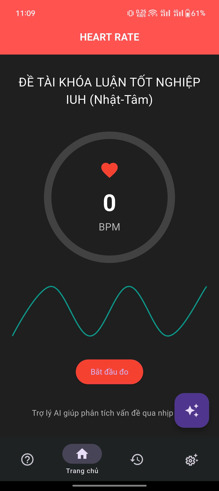
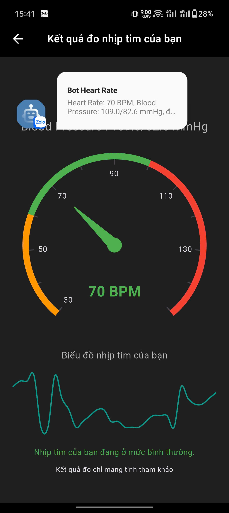
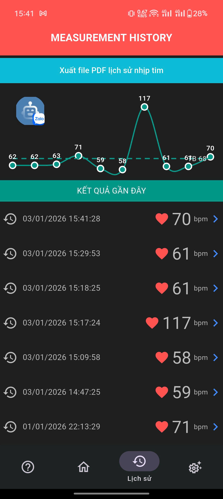
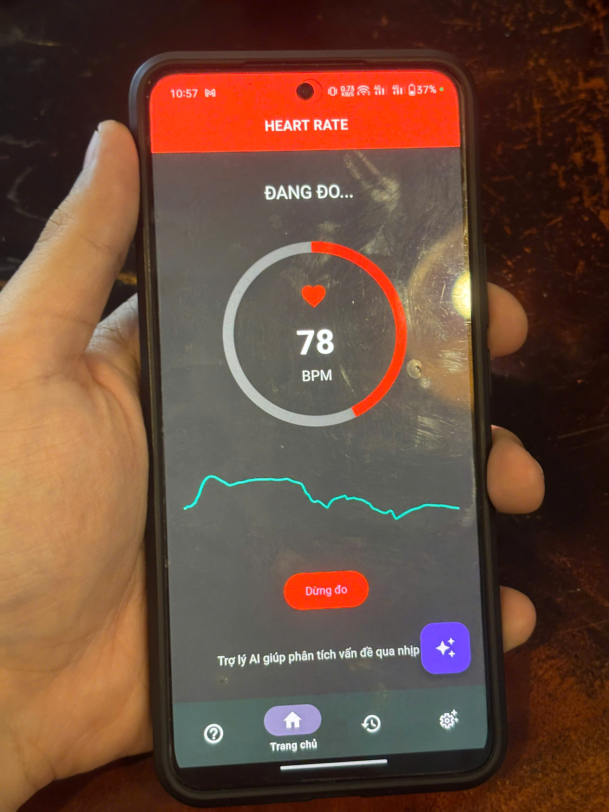

# ❤️ HeartRateApp

A mobile application for **real-time heart rate monitoring** using PPG signal analysis, built with Flutter.  
The app also integrates basic AI features to assist in health insights and blood pressure estimation.

---

## 🚀 Features

- 📊 Real-time heart rate measurement using PPG signal
- 🧠 Basic AI assistant for health-related Q&A
- 📈 Heart rate visualization (live waveform & charts)
- 📝 Measurement history tracking
- 📄 Export history to PDF
- ❤️ Blood pressure estimation using Machine Learning (research-based)

---

## 📱 Demo Screenshots

       
   

---

## 🛠️ Tech Stack

- **Flutter (Dart)** - Mobile App Development
- **PPG Signal Processing** - Heart rate detection
- **Machine Learning (basic)** - Blood pressure prediction
- **Chart Visualization** - Data display
- **AI Integration** - Assistant feature

---

## 📚 How It Works

- The app uses the phone camera to capture PPG signals.
- Signal processing techniques are applied to extract heart rate.
- Features are extracted from the signal (morphology analysis).
- A basic ML model is used to estimate blood pressure.
- Results are visualized and stored for tracking.

---

## ⚠️ Disclaimer

This application is for **educational and research purposes only**.  
The results are not intended for medical diagnosis.

---

## 👨‍💻 Authors

- **Nguyen Phuoc Thanh Tam**
- **Quoc Nhat** (Co-Author)

## ⭐️ML Model
[BP_Prediction_model](https://github.com/ThTam-20/BP_Prediction_model)
